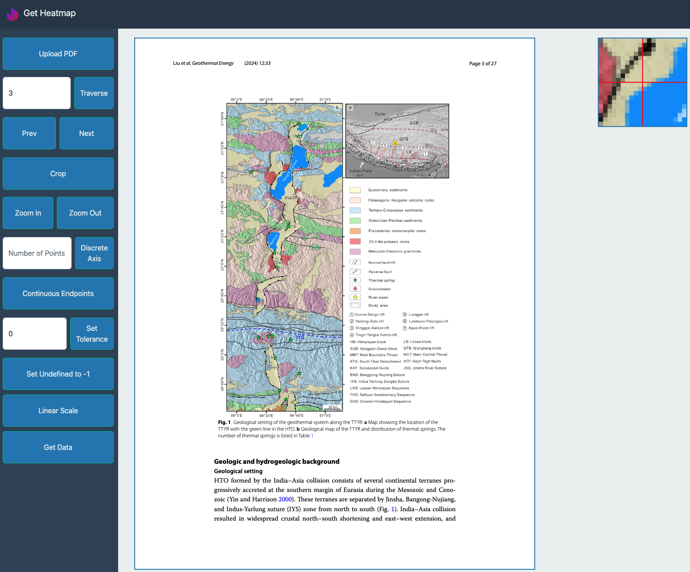

# digitize-heatmap

Lightweight and flexible tool for digitizing heatmaps. A deployment can be found at [ryanfu.me/digitize-heatmap/](http://ryanfu.me/digitize-heatmap/).



The paper used for the above example is Liu et al: [https://doi.org/10.1186/s40517-024-00311-8](https://doi.org/10.1186/s40517-024-00311-8)

## Features

### 1 - PDF Navigation
- Upload PDF
  - Only displays first page on upload
- Traverse Page
  - Jump to any [1-indexed] page of the PDF
- Previous/Next Page
  - Jump to the previous or next page of the PDF
- Crop
  - Select two diagonally opposite corners of a rectangle to select a graph to get data for. Crops the view to only that rectangle. 
- Zoom In/Out
  - Magnifies the current view by increasing the size (in pixel dimensions) of the view. Warning - this may result in bugs when used in between cropping two corners.

### 2 - Data Extraction
- Set Discrete Axis
  - Used for graphs with a discrete colormap. Enter the number of colors you wish to map, then click on an instance of that color and then enter a value to correspond to that color. After the previously entered number of points is chosen, the colormap is saved.
- Choose Continuous Axis Endpoints
  - Used for graphs with a continuous colormap. Requires a linear colormap, and will not work with a 2 (or higher) dimensional colormap. Pick the two endpoints of the linear colormap, as well as the values corresponding to the two, and points will be filled in intermediately. 
  - First toggle Linear/Logarithmic before choosing this option
- Set Tolerance Value
  - When converting the colors on the image to datapoints, set the maximum Manhattan distance a color on the image can be from a color chosen in a previously chosen colormap to qualify as not undefined.
- Toggle Undefined Value Representation
  - By default, undefined values are set to -1. Alternatively, values can be interpolated (this is done by simply finding mapping to the closest occurence of a non-undefined number). 
- Toggle Linear/Logarithmic Scale
  - Changes continuous colorbar scale from linear to logarithmic.
- Get Data
  - Returns a CSV file with the numerical values mapped to a previously saved colormap, in the following format:
  ```
  Row 1 Column 1 Value, Row 1 Column 2 Value, Row 1 Column 3 Value, ...
  Row 2 Column 1 Value, Row 2 Column 2 Value, Row 2 Column 3 Value, ...
  Row 3 Column 1 Value, Row 3 Column 2 Value, Row 3 Column 3 Value, ...
  ```

[A demo of some of the features can be found here.](http://ryanfu.me/digitize-heatmap/assets/demo-video.mp4)

## Documentation

For a detailed explanation of how the code works, you can [read the wiki](https://github.com/RyanFu008/digitize-heatmap/wiki).

## Contributing

Contributions are very welcome. This project attempts to follow the [JavaScript Standard Style](https://github.com/standard/standard) to ensure consistent code format. 

To install locally, simply git clone this repository. Everything is in HTML, Javascript, and a little bit of CSS, so you can instantly see modifications that you've made by opening `index.html` in a web browser. 

Improving functionality, documentation, or adding tests would be greatly appreciated!

## About

I'm Ryan Fu, currently a high school student (junior) at Amador Valley High School, and the main contributor/maintainer of this project.

This project was sparked after a conversation I had with [Dr. Ahinoam Pollack](https://www.linkedin.com/in/ahinoam-pollack/), who is Head of Research for Zanskar Geothermal. Essentially, there was a need for a tool to easily extract quantitative data from heatmaps in scientific papers. The original idea was something similar to [WebPlotDigitizer](https://automeris.io/), but for heatmap graphs. I hope that it can grow beyond only one usecase, and can help significantly more people to come.

If you have any suggestions or feedback, you can reach out to me via email at <ryanfu2008@gmail.com>. I welcome any conversation!
